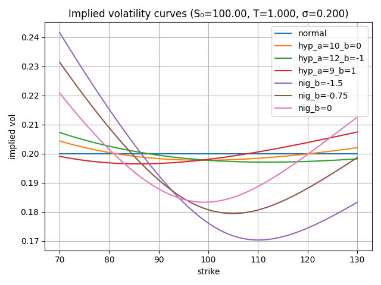

# Non-Normal Option Pricing Comparison
`nonnormalpricing.py` is a self-contained comparison harness that
computes European option prices (call/put/straddle), Black–Scholes implied
volatilities, and distribution moments when the terminal **log-price** or
**price** follows many different parametric families rather than the usual
normal law. `xfit_distributions.py` plus `fit_distributions.py` simulate data
from a configurable Gaussian mixture and fit several of the same families via
SciPy or bespoke MLE routines, saving fit diagnostics to CSV/PNG.
## Highlights

- **Distribution catalog**: normal, [logistic](https://en.wikipedia.org/wiki/Logistic_distribution),
  [Laplace (double exponential)](https://en.wikipedia.org/wiki/Laplace_distribution),
  [hyperbolic secant](https://en.wikipedia.org/wiki/Hyperbolic_secant_distribution),
  [Champernowne](https://en.wikipedia.org/wiki/Champernowne_distribution),
  [generalized error (GED)](https://en.wikipedia.org/wiki/Generalized_normal_distribution),
  [Johnson SU](https://en.wikipedia.org/wiki/Johnson%27s_SU-distribution),
  [Tukey lambda](https://en.wikipedia.org/wiki/Tukey_lambda_distribution),
  [hyperbolic](https://en.wikipedia.org/wiki/Hyperbolic_distribution),
  [generalized hyperbolic (GH)](https://en.wikipedia.org/wiki/Generalized_hyperbolic_distribution),
  [variance gamma (VG)](https://en.wikipedia.org/wiki/Variance-gamma_distribution),
  [normal-inverse Gaussian (NIG)](https://en.wikipedia.org/wiki/Normal-inverse_Gaussian_distribution),
  [CGMY/tempered stable](https://en.wikipedia.org/wiki/Financial_models_with_long-tailed_distributions_and_volatility_clustering),
  [Natural Exponential Family - Generalized Hyperbolic Secant (NEF–GHS)](https://www.statistik.rw.fau.de/files/2016/03/d0042a.pdf), generalized/secant hyperbolic (GSH/SGSH),
  [skew‑t (Jones–Faddy)](https://www.pp.rhul.ac.uk/~cowan/stat/skew_t_jones_and_faddy.pdf),
  [skew normal](https://en.wikipedia.org/wiki/Skew_normal_distribution),
  [asymmetric Laplace](https://en.wikipedia.org/wiki/Asymmetric_Laplace_distribution), [noncentral t](https://en.wikipedia.org/wiki/Noncentral_t-distribution), Student t, etc.
## Distribution Properties

The table below summarizes key characteristics for each log-return distribution
implemented in this project.

| Distribution | # Params | Symmetric? | Skew Control | Excess Kurtosis / Tails |
|--------------|---------:|------------|--------------|------------------|
| Normal | 2 (μ, σ) | Yes | None | 0 (light tails) |
| Logistic | 2 (μ, scale) | Yes | None | 1.2 (sub-exponential) |
| Laplace | 2 (μ, scale) | Yes | None | 3.0 (double-exponential) |
| Hyperbolic secant | 2 (μ, scale) | Yes | None | 2.0 |
| Champernowne | 3 (μ, scale, d) | Yes | None | Varies with d (heavy tails for d<0) |
| GED | 3 (μ, scale, p) | Yes | None | From 3 (p=1) to 0 (p=2) |
| Johnson SU | 4 (a, b, loc, scale) | No | 1 skew (a) | Wide range incl. heavy tails (excess varies) |
| Tukey lambda | 3 (loc, scale, λ) | Yes | None | Tail varies; finite moments depend on λ |
| Hyperbolic | 4 (α, β, δ, μ) | No | β | Heavy but finite tails (excess > 0) |
| Generalized hyperbolic | 5 (λ, α, β, δ, μ) | No | β | Controls both skew/tails widely |
| Variance gamma | 4 (μ, θ, σ, ν) | No | θ | Potentially infinite excess (depends on ν) |
| Normal-inverse Gaussian | 4 (α, β, δ, μ) | No | β | Potentially infinite excess (depends on α,β) |
| CGMY | 6 (C, G, M, Y, scale, μ) | No | G vs M | Tempered power-law tails (finite moments if Y < order) |
| NEF-GHS | 4 (μ, scale, κ, θ) | No | θ | Heavy, log-sech-like tails |
| GSH | 3 (μ, scale, t) | Yes | None | Tails controlled by t (excess varies) |
| SGSH | 4 (μ, scale, t, skew) | No | skew | Same as GSH |
| Skew normal | 3 (shape, loc, scale) | No | shape | Excess kurtosis near 0 |
| Skew-t (Jones–Faddy) | 4 (a, b, loc, scale) | No | (a−b) | Heavy tails; excess depends on a,b |
| Asymmetric Laplace | 3 (κ, loc, scale) | No | κ | Heavy exponential tails (excess 3 regardless of κ) |
| Noncentral t | 3 (df, nc, scale) | No | nc | Heavy algebraic tails (excess finite for df>4) |

## Requirements

- Python 3.11+
- `numpy`, `pandas`, `scipy`, `matplotlib` (for plotting)

- ## Running the option-comparison script

```bash
python nonnormalpricing.py
```

Key settings (all at the top of the file, no CLI flags yet):

- `s0`, `r`, `q`, `t`, `sigma`: market inputs.
- `option_type`: `"c"`, `"p"`, or `"straddle"` (default is `"straddle"`).
- `requested`: list of distribution families to study
  (e.g. `["normal", "hypsecant", "vg"]`); set `max_dist` to truncate the list.
- Distribution-specific parameter grids such as `vg_thetas`, `gh_shapes`,
  `sgsh_shapes`, etc.
- `strike_min/max/step` and `strike_table_stride` (set stride to `0` to hide
  strike-by-strike tables and just emit summary statistics).
- `log_price_mode` toggles log-return vs. direct price densities.
- `PLOT_*` and CSV constants control whether prices/vols are printed, plotted,
  or saved (`option_prices.csv`, `implied_vols.csv`, `density.png`, `vol.png`).
- `print_iv_stats` optionally summarizes implied-vol curvature stats by
  distribution.

Each run prints:

1. Optional price and implied-volatility tables (depending on
   `strike_table_stride`).
2. Log-return or terminal-price moment tables (matching `log_price_mode`).
3. A "Terminal price moments" block (always shown).
4. Diagnostics for any distributions that failed calibration/integration.

If `PLOT_*` filenames are set, density/volatility curves are saved instead of
shown. CSV files use the same labels as the console tables for easy filtering.
An example implied-vol plot generated by the script is shown below:



## Running the fitting workflow

```bash
python optionpricingrecipe.py
```

Workflow (matching the current script defaults):

1. Simulates `nobs = 1000` draws from a two-component Gaussian mixture
   `[(0.1, -0.3, 3.0), (0.9, 0.3, 1.0)]`.
2. Prints descriptive statistics for the sample.
3. Fits each distribution listed in `candidates`
   (`["normal", "skew_normal", "gsh", "sgsh", "t", "nct"]` by default) via
   `fit_distribution`.
4. Logs per-fit metrics (log-likelihood, KS statistic/p-value, parameter count,
   timing, and parameter estimates).
5. Saves `fit_summary.csv` with standardized columns
   (`distribution`, `scipy_name`, `loglike`, `mean_density`, …, `params`,
   `param_names`) plus `fit_densities.png` comparing the empirical histogram,
   ground-truth mixture, and each fitted pdf.

Tweak `nobs`, `components`, `candidates`, or `DENSITY_PLOT_FILE` to explore
other scenarios. Custom fitters registered in `fit_distributions.py`’s
`CUSTOM_FITTERS` dictionary (CGMY, GSH, SGSH, NEF–GHS, VG, etc.) can be added
to the `candidates` list as needed.

## Custom distributions and extensions

- Custom MLE routines in `fit_distributions.py` are registered via the
  `CUSTOM_FITTERS` dictionary; add new entries there to extend `fit_distributions.py`.
- New option-pricing densities require:
  1. Implementing pdf/MGF/tail helpers inside `distributions.py`.
  2. Adding their pricing logic to `option_pricing.py`.
  3. Registering them in `nonnormalpricing.py`’s `requested` builder.

